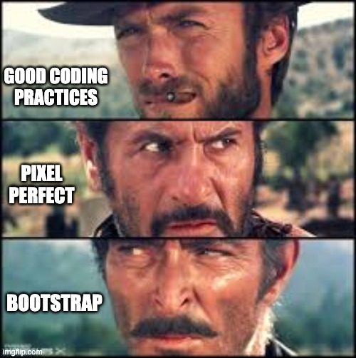

# SBA 3: Design and Development

>*Perfect is the enemy of good.* - Voltaire

Obviously Voltaire was a big fan of Bootstrap.

 [^1]

[^1]Image source: [Facebook](https://www.facebook.com/movieclips/photos/throwback-clip-the-good-the-bad-and-the-ugly-standoff-httpswwwyoutubecomwatchv5p/10153171726572139/?_rdr) , a composite from the movie "The Good, The Bad and the Ugly" 1966 directed by Sergio Leone, modified using imgflip.

## Overview

>In this assessment, you will take a Figma design from Frontend Mentor and implement it using Bootstrap. This project simulates a real-world task where you receive a design handoff and are expected to create a responsive, pixel-perfect webpage. You will apply your knowledge of Bootstrap’s grid system, components, and utility classes while utilizing version control through Git

https://www.frontendmentor.io/challenges/testimonials-grid-section-Nnw6J7Un7

## README Documentation

>Create a README file in your repository that includes:
>An overview of the project and the chosen Frontend Mentor challenge.
>A description of your approach and any customizations made.
>Any challenges faced during implementation and how they were addressed.

## Reflection

>Write a brief reflection (100-200 words) discussing:
>Challenges you encountered during the project.
>Your approach to solving these challenges.
>Improvements you would make if given more time.